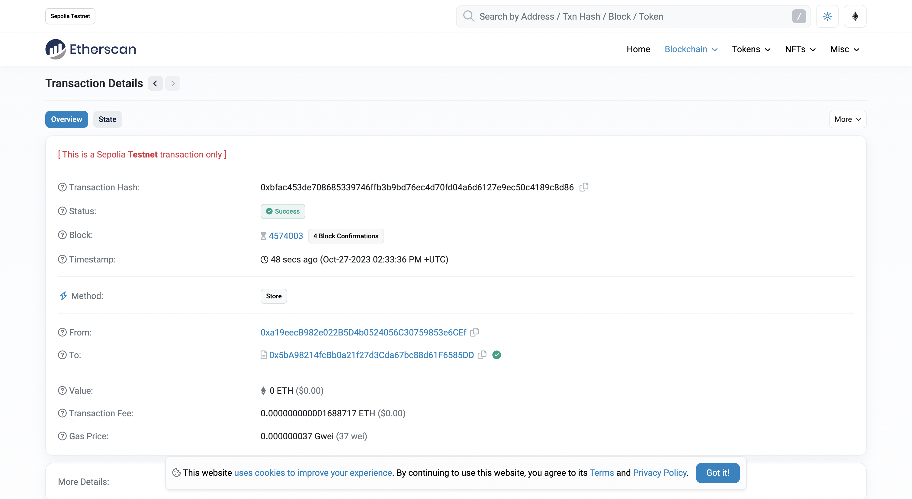
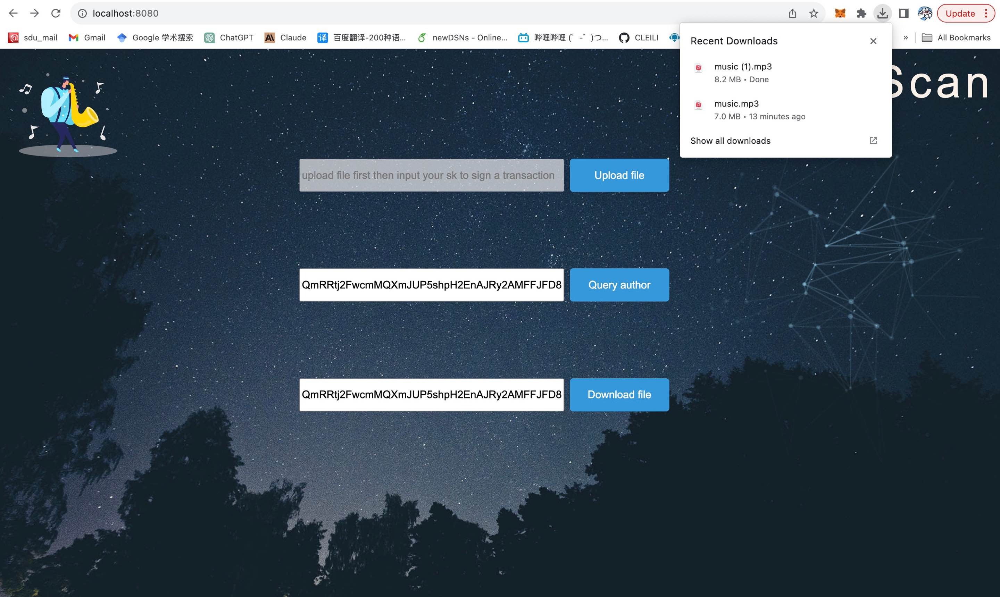

# Music Copyright

融合了以太坊，智能合约，ipfs的音乐鉴权系统。将文件上传到免费的分布式文件系统ipfs上获取到文件的cid，并将文件的cid通过智能合约部署到以太坊区块链上以标识文件cid的归属者。（eth太贵了QAQ，区块链使用的sepolia以太坊测试网）


## 作者

- [@CLEILI](https://github.com/CLEILI)


## 环境配置

Based on MacOs

首先安装go环境 Go1.21.3

```bash
  brew install go
```
安装ipfs
```bash
  brew install ipfs
```


终端进入项目根目录下
```bash
  cd yourdownloadpath/item
```
下载go依赖包
```bash
  go mod tidy
```

## 运行测试
首先运行ipfs节点
```bash
  ipfs init
```

```bash
  ipfs daemon
```
然后运行主函数
```bash
  go run main.go
```
在浏览器输入localhost:8080

## Demo
首先进入初始界面，我在privatekey.txt中提供了两个私钥可供测试使用

上传文件后会显示文件cid，交易哈希。

可以在EtherScan查询签署的交易

通过cid查询该文件的归属者

通过cid下载对应的文件，任何人都可以下载，但是版权是固定的

## For developers
如果你想要自己部署智能合约，在部署合约之后可以运行如下指令获取对应的go文件
```bash
  solc --bin example.sol
```

```bash
  solc --abi example.sol
```

```bash
  ./abigen --bin=Example.bin --abi=Example.abi --pkg=Example --out=Example.go
```

Note:abigen是一个exe文件，在authcid文件夹中


这是两个可供查询和下载的cid的例子
```bash
QmSi9JbT3fn4rsgPgg3Xf4LjGQXs6WSGRt5biwum1usyFd
QmRRtj2FwcmMQXmJUP5shpH2EnAJRy2AMFFJFD8hiWxsdk
```

